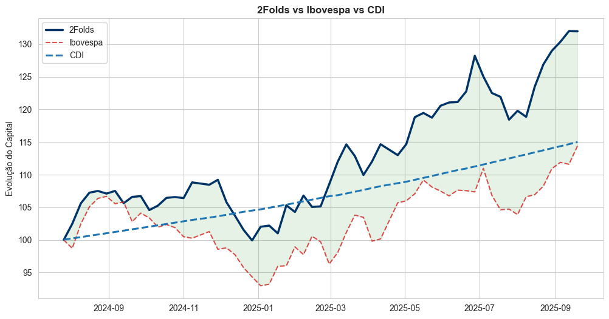

# Project 2Folds

Este repositório apresenta a implementação, backtest e análise da estratégia **2Folds**, um modelo quantitativo de investimento desenvolvido em Python.

A estratégia combina **modelagem estatística baseada em dados técnicos** com **análise de sentimento financeiro integrada a variáveis macroeconômicas**, explorando ineficiências de mercado que emergem da interação entre padrões de preço e fluxo informacional.

---

## Sumário
1. [Visão Geral](#visão-geral)
2. [Hipótese de Investimento](#hipótese-de-investimento)
3. [Metodologia e Modelagem](#metodologia-e-modelagem)
    - [Modelo A: Estrutura Técnica](#modelo-a-estrutura-técnica)
    - [Modelo B: Sentimento Financeiro e Macroeconomia](#modelo-b-sentimento-financeiro-e-macroeconomia)
    - [Seleção e Fusão dos Modelos (2Folds)](#seleção-e-fusão-dos-modelos-2folds)
4. [Regras de Operação e Backtest](#regras-de-operação-e-backtest)
5. [Resultados](#resultados)
6. [Engenharia de Dados](#engenharia-de-dados)

---

## Visão Geral

| Parâmetro | Detalhe |
|---|---|
| **Estratégia** | Portfólio Quantitativo |
| **Classe de Ativos** | Ações |
| **Universo** | Ibovespa |
| **Frequência** | Semanal |
| **Rebalanceamento** | Sexta-feira |
| **Benchmark** | Ibovespa |
| **Avaliação de Risco** | CDI (métrica comparativa) |
| **Tecnologia** | Python (Pandas, XGBoost, HuggingFace, Scikit-learn) |

---

## Hipótese de Investimento

A hipótese central do projeto é que **diferentes ativos e regimes de mercado respondem melhor a diferentes fontes de informação**.

> Modelos baseados exclusivamente em padrões técnicos ou exclusivamente em informações qualitativas tendem a falhar em determinados contextos. A seleção adaptativa entre um **modelo técnico** e um **modelo de sentimento macroeconômico**, com base no histórico de acertos, permite capturar alpha de forma mais robusta e consistente.

O 2Folds não força a combinação simultânea dos modelos, mas **escolhe dinamicamente aquele que apresenta melhor desempenho preditivo para cada ativo**.

---

## Metodologia e Modelagem

A arquitetura do sistema é composta por **dois modelos independentes**, avaliados separadamente para cada ativo elegível após os filtros iniciais.

### Modelo A: Estrutura Técnica

O **Modelo A** é focado na recorrência estatística dos preços e utiliza **XGBoost**, um algoritmo de ensemble baseado em árvores de decisão e otimização por gradiente de segunda ordem.

- **Features Técnicas:**
  - Retornos e volatilidade em múltiplas janelas
  - Indicadores técnicos (RSI, MACD, Bollinger Bands, ATR)
  - Estrutura de candles (corpo, sombras, ranges)
- **Target:** direção ou retorno semanal do ativo
- **Objetivo:** capturar padrões técnicos persistentes, momentum e reversão à média

---

### Modelo B: Sentimento Financeiro e Macroeconomia

O **Modelo B** explora informações **não estruturadas** e variáveis **exógenas ao preço**, atuando sobre a entropia informacional do mercado.

- **Análise de Sentimento Financeiro:**
  - Uso do **FinBERT**, modelo Transformer treinado em linguagem financeira
  - Classificação de notícias em polaridades (positiva, neutra, negativa)
- **Variáveis Macroeconômicas e de Mercado:**
  - Indicadores agregados de risco e ambiente macro
  - Medidas de stress e contexto econômico
- **Objetivo:** capturar mudanças de regime e choques informacionais que ainda não foram totalmente incorporados aos preços

---

## Seleção e Fusão dos Modelos (2Folds)

Apesar do nome do projeto, **não há uso de *folds* no sentido estatístico**. Cada ativo é avaliado individualmente pelos dois modelos.

O processo ocorre da seguinte forma:

- Após os filtros de **valor e liquidez**, cada ativo elegível é avaliado por:
  - **Modelo A (Técnico)**
  - **Modelo B (Sentimento/Macro)**
- Cada modelo gera um **score preditivo**
- Para cada ativo:
  - O modelo com **melhor histórico de acertos** é selecionado
  - O sinal é considerado válido apenas se o score ultrapassar um **threshold > 0.5**
- O modelo vencedor define:
  - A entrada do ativo
  - A direção da exposição

Essa lógica seletiva reduz ruído, evita overfitting estrutural e aumenta a robustez fora da amostra.

---

## Regras de Operação e Backtest

- **Frequência:** rebalanceamento semanal
- **Prevenção de Lookahead Bias:** uso exclusivo de dados disponíveis até a data de decisão
- **Custos de Transação:** considerados no resultado líquido
- **Benchmark:** Ibovespa
- **Avaliação Complementar:** comparação com CDI para análise de prêmio de risco
- **Período:** conforme disponibilidade do dataset consolidado

---

## Resultados

O backtest indicou que a estratégia:

- Superou o **Ibovespa** em retorno total +16.05% (alpha)
- Apresentou métricas superiores ajustadas ao risco (*Sharpe*: 1.16)
- A estratégia gerou um desempenho superior ao ativo livre de risco, representado pelo CDI.
- Superou os modelos unitários (A e B)

Os resultados sugerem que a seleção adaptativa entre modelos técnicos e informacionais contribui para a geração de alpha consistente.

---

## Engenharia de Dados

- **Fontes:**
  - Yahoo Finance (histórico de cotações)
  - Bases públicas e jornais de notícias financeiras
  - Indicadores macroeconômicos públicos
- **Processos:**
  - Limpeza e alinhamento temporal
  - Feature engineering técnico e textual
  - Controle rigoroso de *data leakage*

---

*Disclaimer: Este projeto possui finalidade exclusivamente educacional e acadêmica. Os resultados apresentados são provenientes de simulações (backtests) e não constituem recomendação de investimento.*
